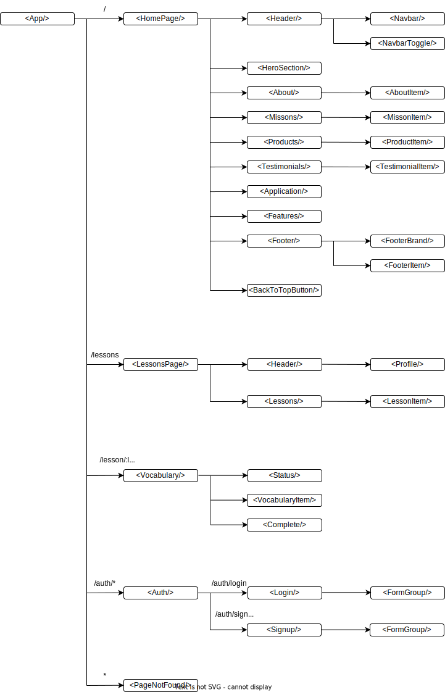
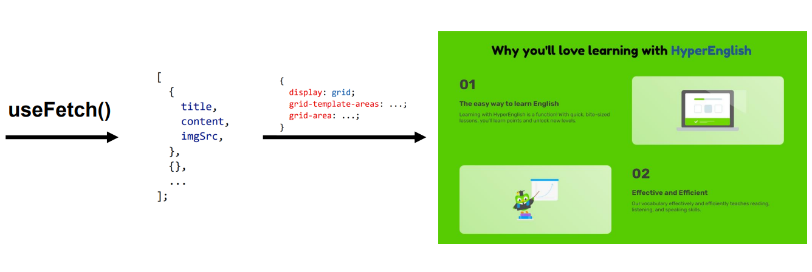
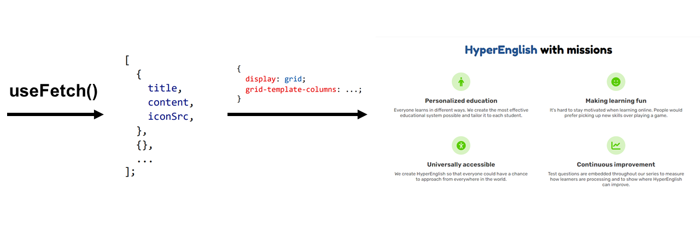
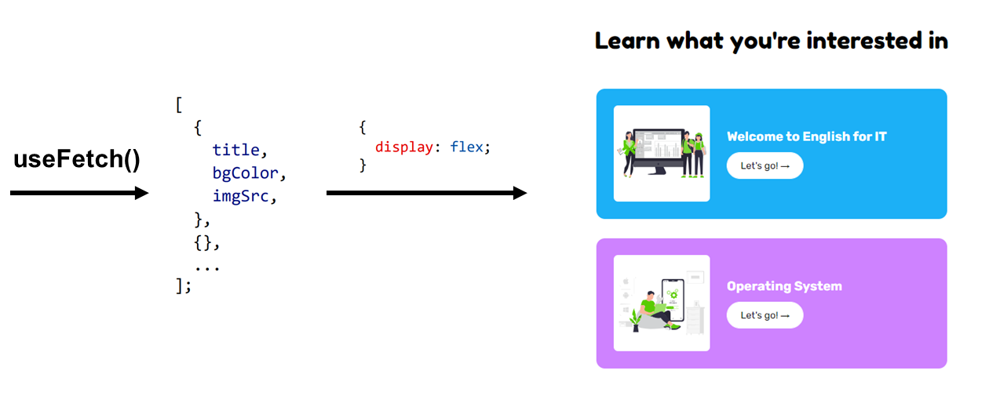
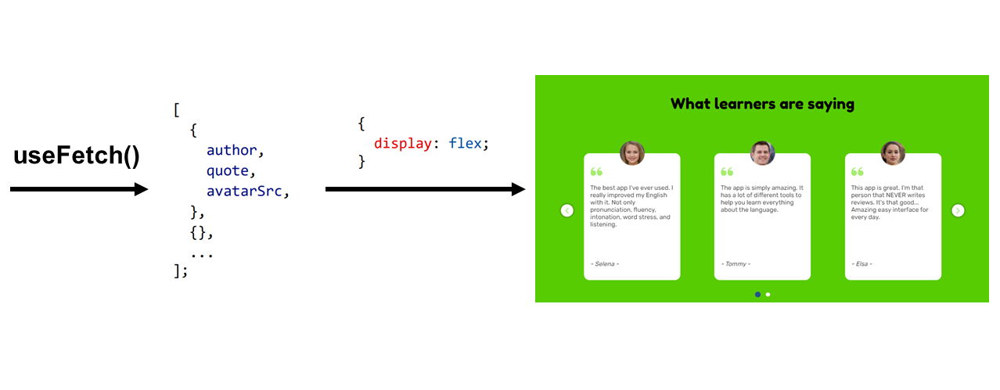
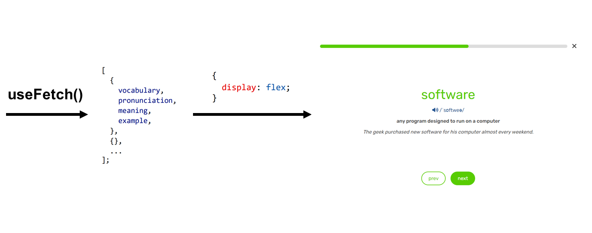

# HyperEnglish Web Application

A project for the portfolio to get a job.

**HyperEnglish** is English vocabulary series that are suitable for students and teachers in Information Technology.

**Technology stack**:&nbsp;
[]()
[]()
[]()
[]()

**Dependencies**:

Client:&nbsp;
[]()
[]()
[]()
[]()
[]()

Server:&nbsp;
[]()
[]()
[]()
[]()

[**Link Demo**](https://fe-hyper-english.onrender.com/)

[**Video Demo**](https://youtu.be/DV2zjr31XlI)


&nbsp;

**Folder structure**:

```text
root/
├── client/
│   ├── public/
│   ├── src/
|   |   ├── assets/
|   |   |   ├── scss/
|   |   |   └── ....
|   |   |
|   |   ├── components/
|   |   |   ├── GlobalStyles/
|   |   |   ├── Button/
|   |   |   ├── PageNotFound/
|   |   │   └── index.js
|   |   |
|   |   ├── hooks/
|   |   |   ├── useFetch.js
|   |   │   └── index.js
|   |   |
|   |   ├── layouts/
|   |   |   ├── About/
|   |   |   ├── Application/
|   |   |   ├── Auth/
|   |   |   ├── Features/
|   |   |   ├── Footer/
|   |   |   ├── Header/
|   |   |   ├── HeroSection/
|   |   |   ├── Lessons/
|   |   |   ├── Missions/
|   |   |   ├── Products/
|   |   |   ├── Testimonials/
|   |   |   ├── Vocabulary/
|   |   │   └── index.js
|   |   |
|   |   ├── pages/
|   |   |   ├── Home/
|   |   |   ├── Lessons/
|   |   │   └── index.js
|   |   |
|   |   ├── routes/
|   |   │   └── index.js
|   |   |
|   |   └── store/
|   |       ├── authSlice.js
|   |       ├── store.js
|   |       └── index.js
|   |
│   ├── App.js
|   └── index.js
|
|
└── server/
    ├── public/
    ├── src/
    |   ├── controllers/
    |   |   ├── authController.js
    |   |   ├── globalErrorController.js
    |   |   ├── vocabularyController.js
    |   |   └── ....
    |   |
    |   ├── models/
    |   |   ├── UserModel.js
    |   |   ├── VocabularyModel.js
    |   |   └── ....
    |   |
    |   ├── routers/
    |   |   ├── userRouter.js
    |   |   |── vocabularyRouter.js
    |   |   └── ....
    |   |
    |   └── utils/
    |       ├── AppError.js
    |       ├── catchError.js
    |       └── ....
    |
    ├── app.js
    └── index.js
```

&nbsp;

**Project architecture**:


&nbsp;

## 1. Client

### 1.1. React DOM tree



&nbsp;

### 1.2. Fetch data from the server

Create a custom hook to fetch data:

```js
function useFetch(param, options = {}) {
  const [data, setData] = useState({});

  useEffect(() => {
    fetch(`${process.env.REACT_APP_SERVER_URL}/${param}`, options)
      .then((res) => res.json())
      .then((result) => setData(result));
  }, [param]);

  return data;
}
```

&nbsp;











&nbsp;

&copy; [huyphamfc](https://github.com/huyphamfc)
