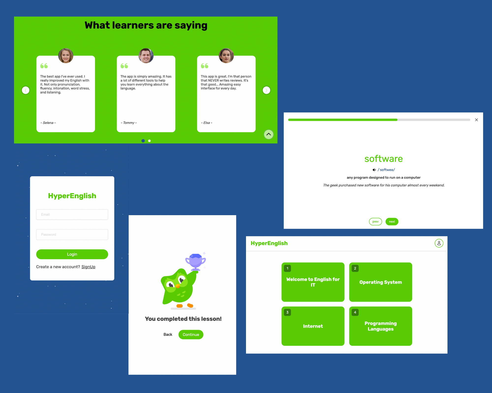

# HyperEnglish Web Application

A project for the portfolio to get a job.

**HyperEnglish** is English vocabulary series that are suitable for students and teachers in Information Technology.

**Technology stack**:&nbsp;

**Dependencies**:

Client:&nbsp;

Server:&nbsp;

[**Link Demo**](https://fe-hyper-english.onrender.com/)

[**Video Demo**](https://youtu.be/DV2zjr31XlI)

&copy; [huyphamfc](https://github.com/huyphamfc)
