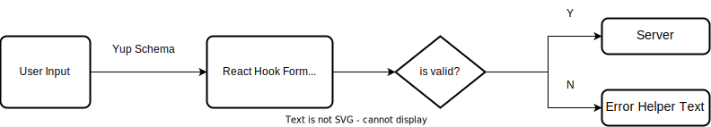

Technology stack: &nbsp;
<a href='https://reactjs.org/'></a>&nbsp;
<a href='https://nodejs.org/en/'></a>
&nbsp;
<a href='https://expressjs.com/'></a>
&nbsp;
<a href='https://www.mongodb.com/'></a>
&nbsp;
<a href='https://www.typescriptlang.org/'></a>
&nbsp;

Dependencies:

- Client: &nbsp;
  <a href='https://sass-lang.com/'></a>&nbsp;
  <a href='https://react-hook-form.com/'></a>&nbsp;
  <a href='https://reactrouter.com/en/main'></a>&nbsp;
  <a href='https://redux-toolkit.js.org/'></a>&nbsp;

- Server: &nbsp;
  <a href='https://mongoosejs.com/'></a>&nbsp;
  <a href='https://jwt.io/'></a>&nbsp;

[Link Demo](https://fe-hyper-english.onrender.com/)

[Video Demo](https://youtu.be/_fTobI0fvnQ?list=UULFBAf2l7BzKyUej40_S2wB-w)

# HyperEnglish - Web Application

**HyperEnglish** is English vocabulary series that are suitable for students and teachers in Information Technology.

I use this project to get my first job as `Fresher FrontEnd Developer`.

&nbsp;

## 1. Quick Overview


&nbsp;

Project architect:


&nbsp;

Project structure:

```text
root/
├── client/
│   ├── public/
│   ├── src/
|   |   ├── assets/
|   |   |   ├── scss/
|   |   |   └── ....
|   |   |
|   |   ├── components/
|   |   |   ├── GlobalStyles/
|   |   |   ├── Button/
|   |   |   ├── Loading/
|   |   |   ├── DataConsuming/
|   |   │   └── index.ts
|   |   |
|   |   ├── hooks/
|   |   |   ├── useFetch.ts
|   |   |   ├── useAppSelector.ts
|   |   |   ├── useAppDispatch.ts
|   |   │   └── index.ts
|   |   |
|   |   ├── layouts/
|   |   |   ├── About/
|   |   |   ├── Application/
|   |   |   ├── Auth/
|   |   |   ├── Features/
|   |   |   ├── Footer/
|   |   |   ├── Header/
|   |   |   ├── HeroSection/
|   |   |   ├── Lessons/
|   |   |   ├── Missions/
|   |   |   ├── Products/
|   |   |   ├── Testimonials/
|   |   |   ├── Vocabulary/
|   |   │   └── index.ts
|   |   |
|   |   ├── models/
|   |   |   ├── about-item.ts
|   |   |   ├── lesson-item.ts
|   |   |   ├── mission-item.ts
|   |   |   ├── product-item.ts
|   |   |   ├── testimonial-item.ts
|   |   |   ├── vocabulary-item.ts
|   |   │   └── index.ts
|   |   |
|   |   ├── pages/
|   |   |   ├── Home/
|   |   |   ├── Lessons/
|   |   |   ├── PageNotFound/
|   |   │   └── index.ts
|   |   |
|   |   ├── routes/
|   |   │   └── index.ts
|   |   |
|   |   └── store/
|   |       ├── authSlice.ts
|   |       ├── store.ts
|   |       └── index.ts
|   |
│   ├── App.tsx
|   └── index.tsx
|
|
└── server/
    ├── public/
    ├── src/
    |   ├── config/
    |   |   ├── db.config.ts
    |   |   ├── env.config.ts
    |   |   └── index.ts
    |   |
    |   ├── controllers/
    |   |   ├── auth.controller.ts
    |   |   ├── about.controller.ts
    |   |   ├── lesson.controller.ts
    |   |   ├── mission.controller.ts
    |   |   ├── testimonial.controller.ts
    |   |   └── index.ts
    |   |
    |   ├── middleware/
    |   |   ├── global-error-handler.middleware.ts
    |   |   ├── unhandled-route-handler.middleware.ts
    |   |   └── index.ts
    |   |
    |   ├── models/
    |   |   ├── about.model.ts
    |   |   ├── lesson.model.ts
    |   |   ├── mission.model.ts
    |   |   ├── testimonial.model.ts
    |   |   ├── user.model.ts
    |   |   └── index.ts
    |   |
    |   ├── routers/
    |   |   ├── user.router.ts
    |   |   ├── about.router.ts
    |   |   ├── lesson.router.ts
    |   |   ├── mission.router.ts
    |   |   ├── testimonial.router.ts
    |   |   └── index.ts
    |   |
    |   └── utils/
    |       ├── AppError.ts
    |       ├── catchAsyncError.ts
    |       ├── sendCookie.ts
    |       ├── sendData.ts
    |       └── index.ts
    |
    ├── app.ts
    └── index.ts
```

&nbsp;

## 2. Building UI

To reuse variables (fonts, colors,...) and blocks of CSS properties, I use `SCSS` and `SCSS Modules` to style HTML elements.

&nbsp;

Row of boxes layout:


&nbsp;

Call to action layout:


&nbsp;

Z-pattern layout:


&nbsp;

Grid of boxes layout:


&nbsp;

## 3. Designing React App

### 3.1. React DOM tree


&nbsp;

I separate the view from the application logic.

- **Container Components** (stateful): care about **what** is shown to the user, and pass data to the presentational components.

- **Presentational Components** (stateless): care about **how** data is shown to the user, receive data through `props`, and render data.

&nbsp;

### 3.2. Custom Hook

- Instead of having the data fetching logic in the **Container Components**, I create a **custom hook** (useFetch) that fetches data.

- By re-using the custom hook, I no longer need to create the data fetching logic in **Container Components**.


&nbsp;

### 3.3. Dynamic Button Component

A custom component with HTML element options (button, anchor, Link (React Router)) and style options (solid, outline, icon, ...) that can be reusable.


&nbsp;

### 3.4. Dynamic Header Styles and Back To Top Button

Change the Header style and show/hide the Back To Top button by tracking the position of the window (viewport) relative to the horizontal axis of the document.

&nbsp;

**Solution 1**: create a scroll event

The scroll event listener triggers whenever the user scrolls the page, which affects the application performance.

```ts
window.addEventListener('scroll', () => {
  if (window.scrollY > value) {
    // change Header style (background-color: white)
    // show BackToTop button
    return;
  }

  // change Header style (background-color: transparent)
  // hide BackToTop button
});
```

&nbsp;

**Solution 2**: use Intersection Observer API

Intersection Observer API tracks asynchronously the target element intersects the root (default: viewport) or not and then executes a specific task (change Header styles and toggle Back To Top button).

```ts
const handleIntersect = () => {
  // change Header styles
  // toggle BackToTop button
};

const options = { root, rootMargin, threshold };

const observer = new IntersectionObserver(handleIntersect, options);
observer.observe(target element)
```

&nbsp;


&nbsp;

### 3.5. Form Validation

Before submitting data to the server, we need to make sure all form fields are filled out and in the correct format. This is called client-side form validation. It reduces server tasks (server-side form validation) and saves resources that the client and server must transform info to each other more times when the form is invalid.

Use React Hook Form with Yup library to validate the form.



&nbsp;

### 3.6. Manage global states

The authentication state works with many components (UI layer) &rarr; use **Redux** to easy to maintain and scale.

&nbsp;

Auth Slice:

```ts
type AuthState = {
  isLogin: boolean;
  user: {
    username?: string;
    email?: string;
  };
};

initialState: <AuthState>{
  isLogin: false,
  user: {},
},

reducers: {
  login(
    state: WritableDraft<AuthState>,
    action: PayloadAction<{ username: string; email: string }>
  ): void {},

  logout(state: WritableDraft<AuthState>): void {},
},
```

&nbsp;


&nbsp;

Workflow:


&nbsp;

## 4. Building Express App

To maintain and scale up the project in the future, we should organize and divide the code into different components based on **MVC architectural pattern**.

&nbsp;


&nbsp;

### 4.1. Database

Use Mongoose and MongoDB for the project.

**HyperEnglish** website stores information about vocabulary (word, pronunciation, meaning, example), lessons (lesson number, title, content, ...), and users (username, email, password).

&nbsp;

### 4.2. Design models

I choose **embedded documents** because data (user, lessons, vocabulary get in 1 query and more reading than writing.

&nbsp;


&nbsp;

### 4.3. Authentication

**Step 1: hash password**

If passwords are kept in plain text and stored in the database, anyone with internal access or hackers who attack the database can see them. So we must convert the password into a complicated string using hashing algorithms.

**Step 2: cookie**

Cookie is a piece of data created by the server.

Cookie store user identity and authenticity information that helps user can access resources from the server.

&nbsp;


&nbsp;

#### 4.4. API Endpoints

The **HyperEnglish API** contains endpoints for About, Missions, Testimonials, Lessons, and Users.

&nbsp;

**GET &nbsp; About**

Use this endpoint to get all `About` content.

```text
{{BASE_URL}}/api/about
```

Example request:

```ts
fetch('{{BASE_URL}}/api/about')
  .then((response) => response.json())
  .then((result) => console.log(result))
  .catch((error) => console.log('error', error));
```

&nbsp;

**GET &nbsp; Missions**

Use this endpoint to get all `Missions` content.

```text
{{BASE_URL}}/api/missions
```

Example request:

```ts
fetch('{{BASE_URL}}/api/missions')
  .then((response) => response.json())
  .then((result) => console.log(result))
  .catch((error) => console.log('error', error));
```

&nbsp;

**GET &nbsp; Lessons**

Use this endpoint to get all `Lessons` content.

```text
{{BASE_URL}}/api/lessons
```

Example request:

```ts
fetch('{{BASE_URL}}/api/lessons')
  .then((response) => response.json())
  .then((result) => console.log(result))
  .catch((error) => console.log('error', error));
```

&nbsp;

**GET &nbsp; Vocabulary**

Use this endpoint to get all `Vocabulary` content but the user must login to access.

```text
{{BASE_URL}}/api/lessons/:lessonNumber
```

Example request:

```ts
const requestOptions = {
  method: 'GET',
  credentials: 'include',
};

fetch('{{BASE_URL}}/api/lessons/:lessonNumber', requestOptions)
  .then((response) => response.json())
  .then((result) => console.log(result))
  .catch((error) => console.log('error', error));
```

&nbsp;

**POST &nbsp; SignUp**

Use this endpoint to create an account.

```text
{{BASE_URL}}/api/user/signup
```

BODY raw

```text
{
  "username": <your-name>,
  "email": <your-email>,
  "password": <your-password>
}
```

Example request:

```ts
const payload = {
  username: 'your-name',
  email: 'your-email',
  password: 'your-password',
};

const requestOptions = {
  method: 'POST',
  credentials: 'include',
  headers: {
    'Content-Type': 'application/json',
  },
  body: JSON.stringify({ ...payload }),
};

fetch('{{BASE_URL}}/api/user/signup', requestOptions)
  .then((response) => response.json())
  .then((result) => console.log(result))
  .catch((error) => console.log('error', error));
```

&nbsp;

**POST &nbsp; Login**

Use this endpoint to login.

```text
{{BASE_URL}}/api/user/login
```

BODY raw

```text
{
  "email": <your-email>,
  "password": <your-password>
}
```

Example request:

```ts
const payload = {
  email: 'your-email',
  password: 'your-password',
};

const requestOptions = {
  method: 'POST',
  credentials: 'include',
  headers: {
    'Content-Type': 'application/json',
  },
  body: JSON.stringify({ ...payload }),
};

fetch('{{BASE_URL}}/api/user/login', requestOptions)
  .then((response) => response.json())
  .then((result) => console.log(result))
  .catch((error) => console.log('error', error));
```

&nbsp;
