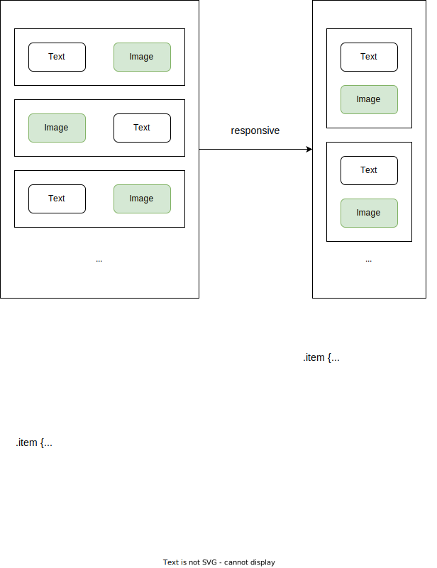
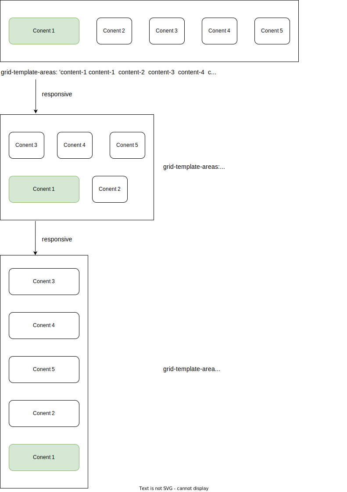

Technology stack: &nbsp;
<a href='https://reactjs.org/'></a>&nbsp;
<a href='https://nodejs.org/en/'></a>
&nbsp;
<a href='https://expressjs.com/'></a>
&nbsp;
<a href='https://www.mongodb.com/'></a>
&nbsp;
<a href='https://www.typescriptlang.org/'></a>
&nbsp;

Dependencies:

- Client: &nbsp;
  <a href='https://sass-lang.com/'></a>&nbsp;
  <a href='https://react-hook-form.com/'></a>&nbsp;
  <a href='https://reactrouter.com/en/main'></a>&nbsp;
  <a href='https://redux-toolkit.js.org/'></a>&nbsp;

- Server: &nbsp;
  <a href='https://mongoosejs.com/'></a>&nbsp;
  <a href='https://jwt.io/'></a>&nbsp;

[Link Demo](https://fe-hyper-english.onrender.com/)

[Video Demo](https://youtu.be/_fTobI0fvnQ?list=UULFBAf2l7BzKyUej40_S2wB-w)

# HyperEnglish - Web Application

**HyperEnglish** is English vocabulary series that are suitable for students and teachers in Information Technology.

I use this project to get my first job as `Fresher FrontEnd Developer`.

&nbsp;

## 1. Quick Overview


&nbsp;

Project architect:


&nbsp;

Project structure:

```text
root/
├── client/
│   ├── public/
│   ├── src/
|   |   ├── assets/
|   |   |   ├── scss/
|   |   |   └── ....
|   |   |
|   |   ├── components/
|   |   |   ├── GlobalStyles/
|   |   |   ├── Button/
|   |   |   ├── Loading/
|   |   |   ├── DataConsuming/
|   |   │   └── index.ts
|   |   |
|   |   ├── hooks/
|   |   |   ├── useFetch.ts
|   |   |   ├── useAppSelector.ts
|   |   |   ├── useAppDispatch.ts
|   |   │   └── index.ts
|   |   |
|   |   ├── layouts/
|   |   |   ├── About/
|   |   |   ├── Application/
|   |   |   ├── Auth/
|   |   |   ├── Features/
|   |   |   ├── Footer/
|   |   |   ├── Header/
|   |   |   ├── HeroSection/
|   |   |   ├── Lessons/
|   |   |   ├── Missions/
|   |   |   ├── Products/
|   |   |   ├── Testimonials/
|   |   |   ├── Vocabulary/
|   |   │   └── index.ts
|   |   |
|   |   ├── models/
|   |   |   ├── about-item.ts
|   |   |   ├── lesson-item.ts
|   |   |   ├── mission-item.ts
|   |   |   ├── product-item.ts
|   |   |   ├── testimonial-item.ts
|   |   |   ├── vocabulary-item.ts
|   |   │   └── index.ts
|   |   |
|   |   ├── pages/
|   |   |   ├── Home/
|   |   |   ├── Lessons/
|   |   |   ├── PageNotFound/
|   |   │   └── index.ts
|   |   |
|   |   ├── routes/
|   |   │   └── index.ts
|   |   |
|   |   └── store/
|   |       ├── authSlice.ts
|   |       ├── store.ts
|   |       └── index.ts
|   |
│   ├── App.tsx
|   └── index.tsx
|
|
└── server/
    ├── public/
    ├── src/
    |   ├── config/
    |   |   ├── db.config.ts
    |   |   ├── env.config.ts
    |   |   └── index.ts
    |   |
    |   ├── controllers/
    |   |   ├── auth.controller.ts
    |   |   ├── about.controller.ts
    |   |   ├── lesson.controller.ts
    |   |   ├── mission.controller.ts
    |   |   ├── testimonial.controller.ts
    |   |   └── index.ts
    |   |
    |   ├── middleware/
    |   |   ├── global-error-handler.middleware.ts
    |   |   ├── unhandled-route-handler.middleware.ts
    |   |   └── index.ts
    |   |
    |   ├── models/
    |   |   ├── about.model.ts
    |   |   ├── lesson.model.ts
    |   |   ├── mission.model.ts
    |   |   ├── testimonial.model.ts
    |   |   ├── user.model.ts
    |   |   └── index.ts
    |   |
    |   ├── routers/
    |   |   ├── user.router.ts
    |   |   ├── about.router.ts
    |   |   ├── lesson.router.ts
    |   |   ├── mission.router.ts
    |   |   ├── testimonial.router.ts
    |   |   └── index.ts
    |   |
    |   └── utils/
    |       ├── AppError.ts
    |       ├── catchAsyncError.ts
    |       ├── sendCookie.ts
    |       ├── sendData.ts
    |       └── index.ts
    |
    ├── app.ts
    └── index.ts
```

&nbsp;

## 2. Building UI

To reuse variables (fonts, colors,...) and blocks of CSS properties, I use `SCSS` and `SCSS Modules` to style HTML elements.

&nbsp;

Row of boxes layout:


&nbsp;

Call to action layout:


&nbsp;

Z-pattern layout:



&nbsp;

Grid of boxes layout:



&nbsp;
